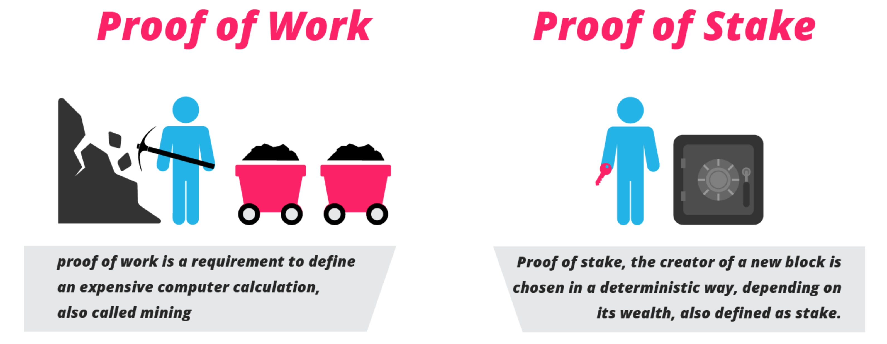

# Pikcio - Proof of Usage

[](https://travis-ci.com/Pikciochain/Proof_of_Usage)
[](https://codecov.io/gh/Pikciochain/Proof_of_Usage)

This project demonstrates how **Pikcio** uses a **Proof of Usage** as a good
alternative to the original *Proof of Work* and the more recent
*Proof of Stake* as a a way to reward nodes in a blockchain.

## In Details

### The context



The *PoW (Proof of Work)* is the original rewarding mechanism introduced by the
*Bitcoin*. It consists in solving a puzzle that requires a lot of
efforts. The more miners solve puzzles, the more the new puzzles are
complicated and require more computation. **This leads to huge energy wastings 
as more and more time and power is dedicated to mining.**

The *PoS (Proof of Stake)* is another distributed consensus algorithm which aims
at rewarding nodes randomly based on the assets they own. Mostly, **this method
relies on the wealth of each node, meaning that the more money you have, the
more money you get.** In addition, it does not encourage nodes to spend their
assets, as it means they might get less rewards in the future.

### The Proof of Usage
Consensus mechanism is the underlying process on which Blockchain relies to 
outcome any fiduciary entity. Therefore, the first objective is to insure 
various parties, interoperating as a whole to sustain a reliable and safe 
network. **PoU (Proof of Usage)** is introduced as it appears fundamental for 
Pikciochain to **build an incentive model where data owners e.g. individuals, 
can be rewarded.** Indeed current models around personal data monetization do not
encompass users i.e. rightful data owners. Additionally the objective would be 
to overcome the stacking effect from PoS to encourage usage by spending over 
retention.

## Content

This project contains a package to deploy a working Proof of Usage in an
environment, along with a simulation and unit tests.

### Understanding the project modules

Each module of this project revolves around one of the main elements of the
application and its sub components.

* `crypto` contains the few cryptographic and random functions required. Its
main function is to encapsulate the actual functions and third-parties used so
that replacing them is easy.
* `keystore` encapsulate the public keys store and handles how keys are
registered, stored and retrieved.
* `transactions` contains the Transaction types definitions along with related
constants.
* `blocks` contains the Block types definition.
* `nodes` contains all kind of nodes definitions and the actions they can
perform.
* `pou` contains the **Proof of Usage** redistribution algorithm. 
* `context` contains objects which define the application variables and let
nodes communicate with each other. Communication is encapsulated in context to
let nodes talk to each other regardless they are running in the same process,
machine or on different platforms.
* `config` lets the program catch parameters, whether they are defaults,
environment variables or command line arguments.

## Getting Started

These instructions will get you a copy of the project up and running on your 
local machine for development and testing purposes. 
See deployment for notes on how to deploy the project on a live system.

### Prerequisites

This project is built upon **Python 3**. However it does not use a lot of
Python 3 only features and should be easily adapted to Python 2.

There is no other prerequisite of third-party required.


### Installing

After cloning the repository on your machine, it is encouraged to create a
virtual environment using your preferred tool. If you have no preference, you
can have a look at `virtualenvwrapper`, easily installed with:

```bash
pip install virtualenvwrapper
```

Once your environment ready and activated, install the pyton depencies using:

```bash
pip install -r requirements.txt
```

Optionally, if you also want to debug, develop or test the project, use:

```bash
pip install -r dev-requirements.txt
```

### Running the simulation
The test simulation is entirely embedded in the `main.py` file. The behavior
of the simulation is directed by a few configuration parameters.

To see what can be configured without changing the code, use:

```bash
python main.py --help
```

You should get something like:
```bash
usage: main.py [-h] [-mac MASTERNODES_COUNT] [-cac CASHINGNODES_COUNT]
               [-coc CONSUMERNODES_COUNT] [-trc TRUSTEDNODES_COUNT]
               [-bt BLOCKTIME] [-fr FEES_RATE] [-rr RETRIBUTION_RATE]
               [-ta TOTAL_ASSETS] [-l] [-rm REMOTE_MASTER]


blockchain: proof of usage

optional arguments:
  -h, --help            show this help message and exit
  -mac MASTERNODES_COUNT, --masternodes-count MASTERNODES_COUNT
                        Number of master nodes
  -cac CASHINGNODES_COUNT, --cashingnodes-count CASHINGNODES_COUNT
                        Number of cashing nodes
  -coc CONSUMERNODES_COUNT, --consumernodes-count CONSUMERNODES_COUNT
                        Number of consumer nodes
  -trc TRUSTEDNODES_COUNT, --trustednodes-count TRUSTEDNODES_COUNT
                        Number of trusted nodes
  -bt BLOCKTIME, --blocktime BLOCKTIME
                        Cycle duration in seconds
  -fr FEES_RATE, --fees-rate FEES_RATE
                        Percentage of transaction amount taken as a fee
  -rr RETRIBUTION_RATE, --retribution-rate RETRIBUTION_RATE
                        Percentage of transaction fees earned by master nodes
  -ta TOTAL_ASSETS, --total-assets TOTAL_ASSETS
                        Initial amount of assets in the market
  -l, --local           Requires a local test instead of a remote one
  -rm REMOTE_MASTER, --remote-master REMOTE_MASTER
                        Index of master to run a remote master node.

```

All options have a default. Each of them can also be defined using environment
variables or command line arguments. Parameters precedence is defined as
following (from highest to lowest priority):
1. Command line arguments,
2. Environment variables,
3. Default settings in this file.

All options are defined in `pikciopou/config.py`. Changing anything there will
affect the whole simulation.

Before running a simulation, please ensure you cleared the output folder
(default is **output/**).

#### Running a local simulation
To run the simulation in a single process, use the `--local` argument while
running the program:

````bash
python main.py --local
````

While this simulation is less realistic, it is easier to run and let you see
the details of the different steps.

#### Running a remote simulation
The remote simulation is more realistic as nodes communicate through HTTP
endpoints, even if they are on the same machine (It stills makes some 
assumptions however for simplicity, like the fact that all nodes are saved in
the same context folders).

To run a remote simulation, you have to create a process for each master
and a last one for all the consumers and cashing nodes.

For example, if you want to run a test with 3 master nodes, type in different 
terminals:
```bash
python main.py -rm N
```
Where N is the index of the master node, e.g: 0, 1, 2.

And finally:
```bash
python main.py -mac 3
```

It is important to run as many masternodes as specified in the main simulation,
otherwise this one might fail because it can't find all the nodes.

#### Simulation output

An output folder is created somewhere according to the configuration. Its
structure is as follows:
```
+ output
|
+--+ keystore
|  |
|  +-- <node_id>
|  +-- ...
| 
+--+ cashingnodes
   |
   +--+ <node_id>
   |  |
   |  +-- host
+--+ consumernodes
   |
   +--+ <node_id>
   |  |
   |  +-- host
+--+ masternodes
   |
   +--+ <node_id>
   |  |
   |  +--+ blocks
   |  +--+ transactions
   |  +-- log.txt
   |  +-- host
   |
   +--+ ...
```

##### Keystore

The keystore contains local copies of the nodes keys. Each file name is
the node's id and the content is the public key of that node.

##### Consumernodes and cashingnodes

Consumernodes adn cashingnodes do not save transaction info, thus only keep:
- A host file (in remote simulation) with ip address and port of its context.

##### Masternodes

Each masternode handles its own directory which name is the node's id. Inside
that directory, the masternode keeps:

- A folder for the **hot transactions**, the ones that have not been wrapped in a
block yet. Transactions are ordered by the time they were made.
- A folder for the **closed blocks**, ordered by the time they were closed.
- a log file of all that node's actions.
- A host file (in remote simulation) with ip address and port of its context.

## Running the tests

Tests are run using following command at the root of the project:

```bash
pytest
```

All tests are kept under the `tests` folder at the root of the project.

To collect the coverage, run following command at the root of the project:
```bash
pytest --cov-report term-missing --cov=pikciopou
```

## Authors

- **Jorick Lartigau** - *Development Lead* - [Pikcio](https://pikciochain.com)
- **Thibault Drevon** - *Architecture and implementation* - [Yellowstones](http://www.yellowstones.io)

